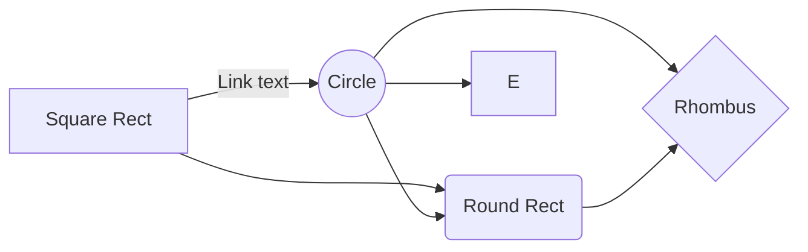

Richardo's Git cheat cheet:

cd ~/alldev/Test2 			 In your terminal, navigate to the project folder

> **ProTip:** You can disable any **Markdown extension** in the **File properties** dialog.

	git branch

to change to another branch:

	git checkout whateverYourBranchNameIs
	
To create a new branch:

	git checkout -b newBranchNameHere
	
**Now you can safely make any and all changes that you want to make**

To save the changes so everybody has these changes in the remote repo
Add files to be committed:

	git add .
	
Commit changes to local repository:

	git commit -m "your message goes here. Tell them what changes you made... like Added a new Login Screen"
	
Push changes to remote repository:

	git push
	
if you get an error here, you might need to set your upstream:

	git push --set-upstream origin theNameOfYourBranch
	
You can also run multiple lines of git commands at the same time:

	git add .
	git commit -m "your message goes here. Tell them what changes you made... like Added a new Login Screen"
	git push
	

